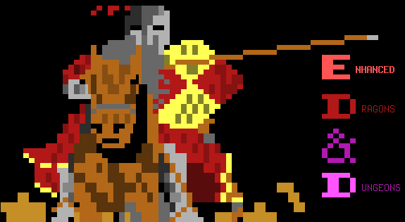

# Enhanced Dragons & Dungeons



## Background

This is a very old Bulletin Board System (BBS) "door game" that I wrote in 1994. As the name suggests, it's a tiny turn-based RPG-style game inspired by a famous paper RPG.

Here's the original description (see [ONLINE.DOC](ONLINE.DOC)):

```
    ED&D is a thrilling fantasy door game, that is very easy to
    learn. You start off as a young warrior, with tremendous ambition
    in becoming the most famous warrior in the land. You start by
    choosing your profession, and race, along with other statistics,
    that will help you on your quest. You quickly find yourself
    in the midst of a town, eager for your gold. You slowly work
    up your knowledge and money bag, challenging stronger and stronger
    warriors until you get to your final foe....
    
    Your destiny is in your hands alone....
```


Although you can run it "stand alone," it'd typically be installed as part of a BBS. A BBS might have many such "door" games installed. When a user selects one of them, the BBS launches the door game for the user to play. Many door games support rudimentary multiplayer support in that the users play in the same "world" but usually not at the same time. Many BBSes only had one phone line, so this wasn't a big limitation. ED&D doesn't have a shared world, but does have a shared top score table, the *hall of fame*.

I haven't tried compiling it, but I did go over the source files a bit. I'm sharing as a curiosity and for archival purposes.

## License Change

I hereby re-license this software and all its files under the MIT license. See the included [LICENSE.MIT.txt](LICENSE.MIT.txt) for the full license and copyright.

I've left the previous license notices (for example, in [INFO.ANS](src/INFO.ANS) just for historical accuracy. They can be replaced as per the new license. Similarly, I've left my old contact information (BBS phone number, email addresses, etc) in the various files, even though they're no longer working.

## What's included

- The the last public release, under `releases/`
- The `.PAS` Pascal source code. I haven't tried compiling it, but at the very least it requires Turbo Pascal 7.0 and "Doorlib." One would start by looking at the `uses` in the main program file, [ED&D.PAS](src/ED&D.PAS).
- `.REC` files contain read-only data
- `.DAT` files vary, but often are binary files converted to Pascal constants.
- ANSI Art (in `.ANS` files). Many files here make use of the IBM 437 code page extended characters that was standard on PCs at that time. In order to view these extended characters correctly, you'll need to remap them to the correct unicode characters. Under Linux, you can look at them with the `iconv` utility:

```
# How to display the ANSI art that uses the extended 437 code page extended characters
iconv -f IBM437 -t UTF8 < INTRO1.ANS
```

Some of these might be animations and have to be played back slowly. There are a few ways to do this, but one way is to use the `pv` tool:

```
# For animations, rate limit the play back to simulate old modems
iconv -f IBM437 -t UTF8 < SPELFIRE.ANS | pv --quiet --rate-limit 200
```

## Source Code Structure

I skimmed over the code just to see its structure. Here's how all the PAS files are included. I'm sure I had a good reason for using "includes" rather than Pascal "units."

```
ED&D.PAS        //main program file
    TYPEHEAD.PAS
    PCLIST.DAT
    TOPHEAD.DAT
    POP.PAS
        W_UTILS.PAS
        A_UTILS.PAS
            ARMOR.REC
        PC_UTILS.PAS
            DELPC.PAS
    VIEWCHAR.PAS
    FIGHT.PAS
    WINDATA.PAS
        CHEST.PAS
    INTRO.PAS
        INFO.DAT
        DAILY.PAS
    MAINMENU.PAS
        HALLFAME.PAS
            HALLFAME.DAT
    MAINLOOP.PAS
        LOADCHAR.PAS
        ITEMHEAD.DAT
        W_SHOP.PAS
        A_SHOP.PAS
        TOWNCHOS.PAS
        INN.PAS
        MAILMENU.PAS
            HALLFAME.PAS
        OUTSIDE.PAS
        CONFIG.PAS
A_RAW.PAS       //raw-rec converter for armor files
    TYPEHEAD.PAS
        ARMOR.RAW
        ARMOR.REC
DELMONST.PAS    //Makes an empty MONSTER.REC
    TYPEHEAD.PAS
    DELPC.PAS
MONLIST.PAS     //REC to LST converter
    TYPEHEAD.PAS
NUKE_A.PAS      //zeros out ARMOR.REC
    TYPEHEAD.PAS
    DELPC.PAS
NUKE_W.PAS      //zeros out WEAPON.REC
    TYPEHEAD.PAS
    DELPC.PAS
PCEDIT.PAS      //player editor (for USER.REC and MONSTER.REC)
    TYPEHEAD.PAS
    PC_UTILS.PAS
PCRAW.PAS       //converts REC to/from RAW
    TYPEHEAD.PAS
    DELPC.PAS
REC2NEW.PAS     //converts old RECs to new RECs
    TYPEHEAD.PAS
RESET.PAS
    TYPEHEAD.PAS
    DELPC.PAS
    DEADINI.PAS
SUGG.PAS        //some debug util
USERLIST.PAS    //lists everything in USER.REC
    TYPEHEAD.PAS
W_RAW.PAS       //raw-rec converter for armor files
    TYPEHEAD.PAS
```
